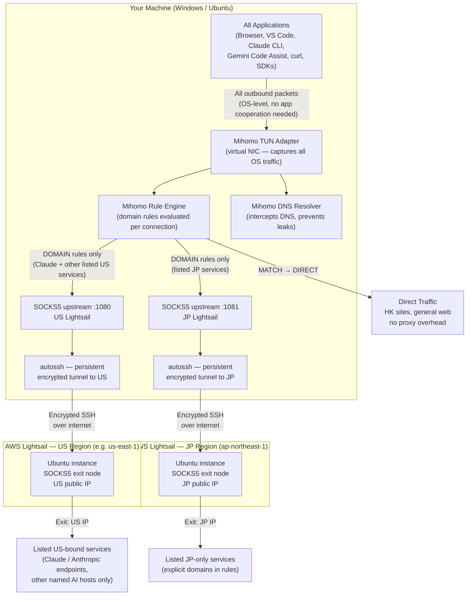
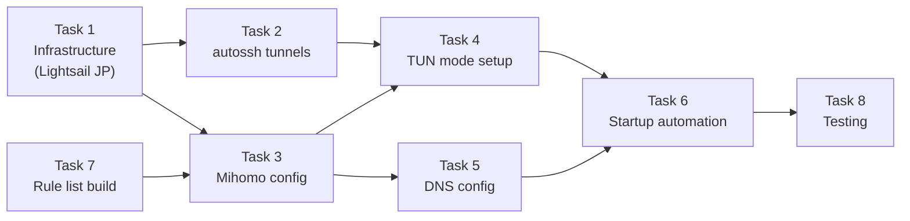

# GeoShift — Architecture & Technical Documentation

> **Purpose:** A multi-platform, multi-region, protocol-agnostic geo-unblocking solution for **listed** Japanese and US-bound services (e.g. Claude across web/API/CLI/IDE, other AI tools you name explicitly) from Hong Kong — not whole-country traffic. Built on rule-based proxy routing via [Mihomo](https://github.com/MetaCubeX/mihomo) and persistent SSH tunnels to AWS Lightsail exit nodes.

---

## Table of Contents

1. [Problem Statement](#1-problem-statement)
2. [Goals & Non-Goals](#2-goals--non-goals) *(subsections: Linux-first rollout, Ubuntu-only prerequisites)*
3. [Core Technical Concepts](#3-core-technical-concepts)
4. [High-Level Architecture](#4-high-level-architecture)
5. [Traffic Flow — Step by Step](#5-traffic-flow--step-by-step)
6. [Why TUN Mode Closes the Gap](#6-why-tun-mode-closes-the-gap)
7. [Component Responsibilities](#7-component-responsibilities)
8. [Task Breakdown](#8-task-breakdown)
9. [Limitations & Known Constraints](#9-limitations--known-constraints)

---

## 1. Problem Statement

Residing in Hong Kong creates two categories of geo-restriction problems:

| Category | Examples | Why Blocked |
|---|---|---|
| Japanese content sites | DMM, NicoNico, Pixiv (adult/regional content), certain streaming | IP-based geo-fence enforcing Japan-only access |
| US AI services | Claude (claude.ai, API), ChatGPT, Gemini Code Assist, Google Antigravity | Service not licensed for HK; IP geo-fence blocks HK ranges |

The **access modes** also differ and each has different technical requirements:

| Access Mode | Examples | Challenge |
|---|---|---|
| Browser | claude.ai, dmm.co.jp | System proxy or PAC file is usually sufficient |
| IDE extensions | Gemini Code Assist in VS Code / Cursor, GitHub Copilot | Extension may or may not honour system proxy |
| CLI / API tools | `claude` CLI, `curl` API calls, SDK-based scripts | Many tools ignore system proxy entirely |

The previous project ([aws-vpn-tunnel-for-claude-ai](https://github.com/ihmcjacky/aws-vpn-tunnnel-for-claude-ai)) solved the browser case via SSH SOCKS5 + PAC file, but explicitly noted that CLI and non-HTTP traffic was **not covered**. GeoShift closes that gap.

---

## 2. Goals & Non-Goals

### Goals
- Cover all three access modes: browser, IDE extensions, CLI/API tools
- Support **selective** routing: **listed** services only (e.g. Claude family — web, API, CLI, Claude Code — → US exit; curated JP-only hosts → JP exit); all other traffic, including unlisted JP/US sites → **direct**
- Run on both **Windows** and **Ubuntu** without maintaining separate codebases — **deliver Ubuntu first**, then port to Windows
- Reuse existing AWS Lightsail infrastructure; add a JP instance
- Minimal performance overhead for non-proxied traffic (direct connections are untouched)

### Non-Goals
- Routing **all** traffic to the US or Japan by country (`GEOIP,US` / `GEOIP,JP` catch-alls) — only dedicated, maintained domain rules apply
- Full device VPN (all traffic through one tunnel) — this would be slower and unnecessary
- Anonymity or privacy guarantees beyond what SSH encryption provides
- Support for mobile devices

### Implementation order (Linux first)

| Phase | Platform | When |
|-------|----------|------|
| **Phase 1** | **Ubuntu** | **Now:** implement and validate Tasks 1–8 on the Linux test machine end-to-end. |
| **Phase 2** | Windows | **After** Phase 1 passes: port tunnels, Mihomo + WinTun, PowerShell / Task Scheduler, re-run the test matrix. |

The same `config.yaml` and rule lists are intended to work on both OSes eventually; only automation and TUN prerequisites differ. **Do not** block Phase 1 on WinTun, WSL2, or Windows Administrator setup.

### Prerequisites to prepare — Phase 1 (Ubuntu only)

Complete these **on the Ubuntu machine** that will run Mihomo and autossh. Skip Windows-specific items until Phase 2.

| Step | What to prepare |
|------|------------------|
| **1. Lightsail** | US + JP instances (Ubuntu), **static IPv4** each; **networking / firewall** allows **TCP 22** from wherever this Ubuntu host connects (your public IP or office IP). |
| **2. SSH** | Private key on this machine (e.g. `~/.ssh/lightsail.pem`, `chmod 600`). Verify `ssh -i … ubuntu@<US_IP>` and `ssh -i … ubuntu@<JP_IP>` **from this Ubuntu box**. |
| **3. Packages** | `autossh`, `curl` (and any clients you will test: browser, VS Code, Claude CLI, etc.). |
| **4. Mihomo** | Linux **mihomo** binary (match your CPU: x86_64 or arm64), install path agreed (e.g. `/usr/local/bin/mihomo`). |
| **5. sudo** | For `setcap` on the Mihomo binary (TUN without root) and for installing **systemd** units under `/etc/systemd/system/`. |
| **6. Local secrets** | Non-git file for IPs + key path (e.g. `geoshift.env` or `config.local.yaml`) — referenced by scripts/units; never commit keys. |
| **7. IPv6 (optional)** | Note whether you disable IPv6 or rely on Mihomo TUN IPv6 support (see §9). |

**Phase 2 (later) — prepare when starting Windows:** WinTun (`wintun.dll`), Mihomo Windows build, Administrator or Task Scheduler elevation, and WSL2 vs native tunnel strategy.

---

## 3. Core Technical Concepts

### 3.1 SOCKS5 Proxy

SOCKS5 is an application-layer proxy protocol (RFC 1928). A SOCKS5 server sits between a client and a destination server, forwarding TCP/UDP traffic on the client's behalf.

```
Client App  →  SOCKS5 proxy  →  Destination server
              (on localhost)     (appears to come from proxy's IP)
```

**Key property:** The destination server sees the proxy's IP address, not the client's. This is what enables geo-unblocking.

**Limitation:** The client application must explicitly support and be configured to use SOCKS5. Applications that do not check proxy settings — or are hardcoded to connect directly — bypass the proxy entirely.

### 3.2 SSH Dynamic Port Forwarding (`-D`)

SSH's `-D` flag creates a **SOCKS5 server on the local machine** that tunnels all traffic through the SSH connection to the remote host.

```bash
ssh -i key.pem -N -D 1080 user@lightsail-ip
#                 ^^^^^^^^ listen on local port 1080 as SOCKS5
```

What happens:
1. Local app connects to `127.0.0.1:1080` (the SOCKS5 listener)
2. SSH encrypts and tunnels the request to the Lightsail instance
3. Lightsail opens the connection to the actual destination
4. Response returns through the encrypted tunnel

**autossh** wraps this command with automatic reconnection logic, so the tunnel survives network interruptions and machine reboots.

### 3.3 PAC (Proxy Auto-Config) Files

A PAC file is a JavaScript file with a `FindProxyForURL(url, host)` function. Browsers call this function for each request and follow its return value (`DIRECT`, `PROXY host:port`, `SOCKS5 host:port`, etc.).

**Limitation:** PAC files are a browser concept. They have zero effect on IDE extensions, CLI tools, or any non-browser application. This is why the previous project's approach did not cover Claude CLI or Gemini Code Assist.

### 3.4 System Proxy Settings (HTTP_PROXY / HTTPS_PROXY)

Both Windows (via `Settings > Network > Proxy`) and Linux (via environment variables `http_proxy`, `https_proxy`) expose a system-wide proxy configuration.

**Limitation:** These are **opt-in** — each application must explicitly read these settings and honour them. Many CLI tools, language runtimes (Go, Rust), and IDE extensions either ignore them entirely or only partially support them.

### 3.5 TUN Mode (Virtual Network Adapter)

TUN (Network TUNnel) is a Linux kernel feature (also available on Windows via the WinTun driver) that lets a userspace program create a **virtual Layer-3 network interface**.

When Mihomo runs in TUN mode:
1. It creates a virtual NIC (e.g., `utun0` / `Meta`) and assigns it an IP
2. Mihomo installs OS routing rules that redirect all outbound traffic to this virtual NIC
3. Every packet from every application — regardless of whether it knows about proxies — flows into Mihomo
4. Mihomo reads the destination IP/domain, evaluates its rule list, and forwards the connection to the appropriate upstream proxy or directly

This is **functionally identical to how a VPN client works**, with one critical difference: instead of routing everything through one tunnel based on IP ranges, Mihomo routes based on **domain name rules** evaluated per-connection.

### 3.6 Rule-Based Routing (Mihomo Rule Engine)

Mihomo's rule list is an ordered list of match conditions evaluated top-to-bottom. The first matching rule wins.

```yaml
rules:
  - DOMAIN-SUFFIX,claude.ai,US-PROXY       # example: Claude web
  - DOMAIN-SUFFIX,anthropic.com,US-PROXY   # API, CLI, Claude Code — add every host your tools use
  - DOMAIN-SUFFIX,openai.com,US-PROXY      # other US AI products only if you list them
  - DOMAIN-SUFFIX,dmm.co.jp,JP-PROXY       # example: curated JP service
  - DOMAIN-SUFFIX,nicovideo.jp,JP-PROXY
  # Intentionally no GEOIP,US / GEOIP,JP — random US/JP sites stay DIRECT
  - MATCH,DIRECT                           # everything not listed → direct
```

Rule types available:

| Rule Type | Matches On | Example |
|---|---|---|
| `DOMAIN` | Exact domain | `DOMAIN,claude.ai,PROXY` |
| `DOMAIN-SUFFIX` | Domain and all subdomains | `DOMAIN-SUFFIX,anthropic.com,PROXY` |
| `DOMAIN-KEYWORD` | Any domain containing keyword | `DOMAIN-KEYWORD,openai,PROXY` |
| `IP-CIDR` | Destination IP range | `IP-CIDR,172.217.0.0/16,PROXY` |
| `GEOIP` | IP country code (MaxMind DB) | `GEOIP,US,PROXY` |
| `MATCH` | Catch-all (always last) | `MATCH,DIRECT` |

`GEOIP` rules are optional; GeoShift intentionally does **not** use country-wide `GEOIP,US` / `GEOIP,JP` entries so ordinary browsing to those regions stays direct.

### 3.7 DNS Leak Prevention

When TUN mode is active, Mihomo also intercepts DNS queries. Without this, a DNS query for `claude.ai` would go directly to the ISP's DNS server in HK, revealing the hostname being accessed even if the subsequent HTTPS traffic goes through the tunnel.

Mihomo resolves domains via **fake-ip** or **redir-host** mode:
- **fake-ip**: Mihomo returns a synthetic private IP (e.g., `198.18.x.x`) immediately, then maps the real IP after the connection is established through the correct proxy
- **redir-host**: Mihomo resolves the real IP but routes the DNS query itself through the proxy

Both modes ensure DNS queries for proxied domains travel through the encrypted tunnel to the exit node's DNS, not the local ISP.

---

## 4. High-Level Architecture



---

## 5. Traffic Flow — Step by Step

### Scenario A: Browser accessing `claude.ai`

```
1. Browser initiates TCP connection to claude.ai:443

2. OS routing table: all traffic → Mihomo TUN adapter (utun0 / Meta)

3. Mihomo TUN receives the TCP SYN packet
   - Reads destination: claude.ai:443
   - Queries internal DNS: "what is claude.ai?" → fake-ip returned immediately

4. Mihomo Rule Engine evaluates rules (top to bottom):
   - DOMAIN-SUFFIX,claude.ai,US-PROXY  ← MATCH
   - Dispatch: connect via SOCKS_US

5. Mihomo opens SOCKS5 connection to 127.0.0.1:1080
   - autossh is listening on :1080, tunneling to US Lightsail via SSH

6. US Lightsail receives the tunneled connection
   - Opens TCP to claude.ai:443 from its own US IP address
   - Anthropic's servers see: US IP → access granted

7. TLS handshake completes end-to-end (Mihomo is transparent to TLS)

8. Response flows back:
   claude.ai → US Lightsail → SSH tunnel → Mihomo → TUN → Browser
```

### Scenario B: `claude` CLI tool making an API call to `api.anthropic.com`

```
1. Claude CLI calls api.anthropic.com:443 — does NOT check system proxy settings

2. OS routing: packet hits Mihomo TUN anyway (all traffic, no exceptions)

3. Rule match: DOMAIN-SUFFIX,anthropic.com,US-PROXY

4. Same path as Scenario A from step 5 onward

Result: CLI tool works transparently, zero configuration change needed in the tool itself
```

### Scenario C: VS Code with Gemini Code Assist connecting to `generativelanguage.googleapis.com`

```
1. VS Code extension connects to googleapis.com:443

2. Mihomo TUN intercepts (extension's proxy configuration irrelevant)

3. Rule match: DOMAIN-SUFFIX,googleapis.com,US-PROXY

4. Traffic exits from US Lightsail IP → Google API access granted
```

### Scenario D: Accessing `dmm.co.jp` in browser

```
1. Browser: TCP SYN to dmm.co.jp:443

2. Mihomo Rule Engine:
   - DOMAIN-SUFFIX,dmm.co.jp,JP-PROXY  ← MATCH

3. Connection goes through SOCKS_JP (:1081) → SSH tunnel → JP Lightsail

4. DMM servers see: JP IP → access granted
```

### Scenario E: Accessing a HK-friendly site (e.g., `google.com.hk`)

```
1. TCP SYN to google.com.hk:443

2. Mihomo Rule Engine: no specific rule matches
   - Falls through to: MATCH,DIRECT

3. Mihomo passes the packet directly to the OS network stack
   - No tunnel, no SSH overhead
   - Exits from your HK IP as normal

Result: No performance impact for non-proxied traffic
```

### Scenario F: DNS resolution (leak prevention)

```
1. Any app queries DNS for "claude.ai" (UDP :53)

2. Mihomo TUN intercepts the DNS packet before it reaches the ISP DNS

3. Mihomo checks: does "claude.ai" match a proxied rule? → Yes (US-PROXY)

4. DNS query is forwarded through the US SSH tunnel to an upstream resolver
   (e.g., 8.8.8.8 resolved from the US Lightsail instance)

5. Real IP returned and mapped internally; fake-ip returned to the app

Result: ISP never sees that you queried "claude.ai"; no DNS leak
```

---

## 6. Why TUN Mode Closes the Gap

This is the critical architectural insight that distinguishes GeoShift from the PAC/system-proxy approach.

### The proxy opt-in problem

```
Application
    │
    ├── Does it check HTTP_PROXY env var? → Only if developer implemented it
    ├── Does it check Windows system proxy? → Only if it uses WinINet/WinHTTP
    ├── Does it accept a --proxy flag? → Only if developer added one
    └── If none of the above: connects directly, bypasses all proxy config
```

Examples of tools that commonly **ignore** system proxy:
- Go-based CLI tools (many AWS tools, Terraform, Claude CLI built with Go)
- Electron apps using native fetch (some IDE extensions)
- Tools using libcurl without proxy env vars compiled in
- gRPC connections in some SDK implementations

### OSI layer comparison

| Approach | OSI Layer | Captures |
|---|---|---|
| PAC file | Layer 7 (Application) | Browser only |
| System proxy (HTTP_PROXY) | Layer 7 (Application) | Apps that opt in |
| SOCKS5 configured per-app | Layer 5 (Session) | Apps that opt in |
| TUN mode (Mihomo) | Layer 3 (Network) | **All apps, no exceptions** |
| Full VPN (WireGuard/OpenVPN) | Layer 3 (Network) | All apps, no exceptions |

TUN and full VPN operate at the same layer — the difference is that TUN gives Mihomo per-connection control over routing decisions via domain rules, whereas a full VPN routes everything through one tunnel regardless of destination.

```
Full VPN:         All traffic  →  Single tunnel  →  One exit IP
GeoShift (TUN):   All traffic  →  Mihomo rules   →  US / JP exit (listed hosts only) / DIRECT
                                  (explicit domains, not whole countries)
```

---

## 7. Component Responsibilities

| Component | Role | Platform |
|---|---|---|
| **Mihomo** | Rule engine, TUN virtual NIC, DNS interception, upstream proxy dispatch | Windows (x86\_64 binary) + Linux (x86\_64 / arm64 binary) |
| **WinTun driver** | Kernel-level TUN adapter implementation for Windows | Windows only |
| **autossh** | Persistent SSH tunnel with automatic reconnection on failure | Linux native; Windows via WSL2 or Git Bash |
| **AWS Lightsail US** | SOCKS5 exit node, provides a US public IP | Cloud (us-east-1 recommended) |
| **AWS Lightsail JP** | SOCKS5 exit node, provides a JP public IP | Cloud (ap-northeast-1) |
| **Mihomo config.yaml** | Defines proxies, proxy groups, rule list, DNS settings | Shared (same file works on Win + Linux) |
| **Startup script (PowerShell)** | Brings up autossh tunnels + Mihomo on Windows login | Windows |
| **Startup script (bash / systemd)** | Brings up autossh tunnels + Mihomo on Ubuntu boot | Linux |
| **Rule lists** | Explicit domain lists per product (e.g. all Anthropic/Claude endpoints); not full-country routing | Platform-agnostic (YAML) |

---

## 8. Task Breakdown

The implementation is divided into 8 tasks in dependency order. **Execute Phase 1 on Ubuntu through Task 8 before** starting Windows (Phase 2) automation and WinTun setup.



### Task 1 — Infrastructure: AWS Lightsail JP Instance

**Scope:** Provision a second Lightsail instance in the `ap-northeast-1` (Tokyo) region. The US instance from the previous project is already available.

**Deliverables:**
- JP Lightsail instance running Ubuntu, static IP assigned
- SSH key pair configured for passwordless login
- Both instances' IPs and `.pem` key paths recorded in `config.ini`

**Notes:** No additional software needed on the Lightsail instances — the SSH server (`sshd`) and TCP forwarding are sufficient. SOCKS5 proxying is performed by the SSH client on the local machine; the server just relays the traffic.

---

### Task 2 — autossh Tunnel Setup

**Scope (Phase 1 — Ubuntu):** Establish persistent SOCKS5 tunnels on the **Ubuntu test machine** using `autossh`. Two tunnels run locally at once:
- `autossh ... -D 1080 ... us-lightsail` (US exit on local port 1080)
- `autossh ... -D 1081 ... jp-lightsail` (JP exit on local port 1081)

**Scope (Phase 2 — Windows):** Repeat the same port layout on Windows (WSL2, Git Bash, or another supported approach) after Linux validation.

**Deliverables (Phase 1):**
- `autossh` installed on Ubuntu (`apt`) and both tunnel commands tested
- Reconnection verified (kill the child `ssh`; confirm `autossh` restarts it)

**Platform notes:**
- **Ubuntu (now):** native `autossh` via `apt`
- **Windows (later):** WSL2 (recommended) or standalone / Git Bash — documented in Phase 2

---

### Task 3 — Mihomo Configuration

**Scope:** Write the core `config.yaml` on **Ubuntu first**; keep it portable so the same file (paths permitting) can be reused on Windows in Phase 2.

**Key sections to configure:**

```yaml
# Proxy definitions (upstream SOCKS5 targets)
proxies:
  - name: US-Lightsail
    type: socks5
    server: 127.0.0.1
    port: 1080
  - name: JP-Lightsail
    type: socks5
    server: 127.0.0.1
    port: 1081

# Proxy groups (for UI dashboard toggling)
proxy-groups:
  - name: US-PROXY
    type: select
    proxies: [US-Lightsail, DIRECT]
  - name: JP-PROXY
    type: select
    proxies: [JP-Lightsail, DIRECT]

# Rules (evaluated top-to-bottom, first match wins)
rules:
  - DOMAIN-SUFFIX,claude.ai,US-PROXY
  - DOMAIN-SUFFIX,anthropic.com,US-PROXY
  - DOMAIN-SUFFIX,openai.com,US-PROXY
  - DOMAIN-SUFFIX,chatgpt.com,US-PROXY
  - DOMAIN-SUFFIX,googleapis.com,US-PROXY
  - DOMAIN-SUFFIX,gemini.google.com,US-PROXY
  - DOMAIN-SUFFIX,dmm.co.jp,JP-PROXY
  - DOMAIN-SUFFIX,nicovideo.jp,JP-PROXY
  # No GEOIP country catch-alls — extend this list when a tool needs a new hostname
  - MATCH,DIRECT
```

**Deliverables:**
- On **Ubuntu:** `config.yaml` tested with Mihomo in non-TUN mode first (SOCKS5 only) to validate rules
- Proxy groups verified via Mihomo dashboard (`http://127.0.0.1:9090/ui`)

---

### Task 4 — TUN Mode Setup

**Scope:** Enable Mihomo's TUN adapter. **Phase 1:** Ubuntu only. **Phase 2:** Windows + WinTun. TUN captures all OS traffic, not just browser traffic.

**Windows specifics (Phase 2):**
- Download `wintun.dll` from [wintun.net](https://www.wintun.net) and place in Mihomo's directory
- Run Mihomo as Administrator (TUN requires elevated privileges to create the virtual NIC)
- Add to `config.yaml`:
  ```yaml
  tun:
    enable: true
    stack: mixed       # gVisor for UDP, system for TCP — best compatibility
    auto-route: true   # installs OS routing rules automatically
    auto-detect-interface: true
  ```

**Linux (Ubuntu) specifics (Phase 1):**
- Grant Mihomo `cap_net_admin` capability (avoids running as root):
  ```bash
  sudo setcap cap_net_admin,cap_net_bind_service+ep /usr/local/bin/mihomo
  ```
- Same TUN config block in `config.yaml`

**Deliverables:**
- **Phase 1:** TUN active on Ubuntu (`ip addr` shows Mihomo tun); a proxy-agnostic `curl` to a listed US host exits via US Lightsail
- **Phase 2:** Repeat on Windows (Device Manager / admin Mihomo) when porting

---

### Task 5 — DNS Configuration

**Scope:** Configure Mihomo's built-in DNS to prevent DNS leaks and support domain-based rule matching.

```yaml
dns:
  enable: true
  listen: 0.0.0.0:53
  enhanced-mode: fake-ip
  fake-ip-range: 198.18.0.1/16
  nameserver:
    - 8.8.8.8          # resolved through proxy when domain matches proxy rule
    - 1.1.1.1
  fallback:
    - 114.114.114.114  # HK/CN fallback for non-proxied domains
  fallback-filter:
    geoip: true
    geoip-code: CN
```

**Deliverables:**
- DNS leak test confirms that queries for proxied domains resolve via the exit node's DNS
- `claude.ai` resolves to a fake-ip range entry (e.g., `198.18.x.x`) confirming interception is working

---

### Task 6 — Startup Automation

**Scope:** Automate bring-up. **Phase 1:** ship **Ubuntu** first (`start-geoshift.sh` + systemd). **Phase 2:** add Windows (`Start-GeoShift.ps1` + Task Scheduler).

**Ubuntu (Phase 1 — primary):**
1. `geoshift-tunnel-us.service` — systemd unit for autossh US tunnel
2. `geoshift-tunnel-jp.service` — systemd unit for autossh JP tunnel
3. `geoshift-mihomo.service` — systemd unit for Mihomo (depends on both tunnel services)

**Windows (Phase 2):** `Start-GeoShift.ps1` — ensure autossh tunnels, wait for 1080/1081, launch Mihomo elevated, optional dashboard open.

**Deliverables:**
- **Phase 1:** `systemctl enable …` brings the full stack up on Ubuntu boot
- **Phase 2:** Windows script + scheduled task (or equivalent)

---

### Task 7 — Rule List Build & Maintenance

**Scope:** Build the initial domain rule lists and establish a maintenance process.

**Initial rule sets:**
- **Per product:** enumerate every hostname each tool hits (Claude web vs API vs CLI vs IDE extensions may differ; add CDN or auth domains as you discover them)
- Same idea for any other US AI or JP-only product you actually use — not “all `.jp`” or “all US IPs”

**Community rule sources (optional, for larger lists):**
- [Loyalsoldier/clash-rules](https://github.com/Loyalsoldier/clash-rules) — maintained lists for common services
- These can be loaded via `rule-providers` in `config.yaml` with automatic updates

**Deliverables:**
- Curated `rules/us-ai.yaml` and `rules/jp-sites.yaml`
- `config.yaml` updated to reference these via `rule-providers`

---

### Task 8 — Testing & Validation

**Scope:** Verify end-to-end on the **Ubuntu test host** in Phase 1 (browser, `curl`, CLI, IDE as applicable). Re-run the same matrix on **Windows** in Phase 2 after porting.

**Test matrix:**

| Scenario | Tool | Expected exit IP | Pass criteria |
|---|---|---|---|
| claude.ai web | Chrome | US IP | Page loads, no geo-block |
| api.anthropic.com | `curl` (direct, no proxy flag) | US IP | 200 response with API key |
| Gemini Code Assist | VS Code extension | US IP | Code suggestions working |
| Claude CLI | `claude` command | US IP | CLI connects and responds |
| dmm.co.jp | Chrome | JP IP | Site loads, no geo-block |
| google.com.hk | Chrome | HK IP | Direct, no tunnel |
| IP check | `curl ifconfig.me` via specific proxy | Per-rule | Correct IP per proxy |

**Validation tools:**
- `curl ifconfig.me` — check exit IP
- [ipleak.net](https://ipleak.net) — check DNS leaks
- [browserleaks.com](https://browserleaks.com) — WebRTC and DNS leak check
- Mihomo dashboard (`http://127.0.0.1:9090/ui`) — real-time connection log to confirm rule matches

---

## 9. Limitations & Known Constraints

| Constraint | Impact | Mitigation |
|---|---|---|
| TUN mode requires elevated privileges on Windows | Script must run as Administrator or via Task Scheduler with "Run as administrator" | Pre-configure Task Scheduler entry at setup |
| autossh on Windows requires WSL2 or Git Bash | Additional dependency on Windows | Document WSL2 as a prerequisite; alternatively use `plink` (PuTTY) as a Windows-native alternative |
| SSH tunnel latency | Adds ~20-80ms RTT depending on server location | Acceptable for API calls and web browsing; not suitable for real-time voice/video |
| Lightsail instance costs | Two instances (US + JP) at ~$3.50–$5/month each | Minimal; can share instances with other projects |
| Rule list maintenance | New services or CDN domains may require rule additions | Use community `rule-providers` for auto-updated lists |
| TLS inspection not possible | Mihomo cannot inspect encrypted traffic content; routing is domain-based only | Not a limitation for this use case; geo-unblocking only needs to route the connection, not inspect it |
| IPv6 leak risk | Some TUN implementations may not intercept IPv6 traffic | Disable IPv6 on the machine or ensure Mihomo's TUN config covers IPv6 |

---

*Last updated: March 2026*
