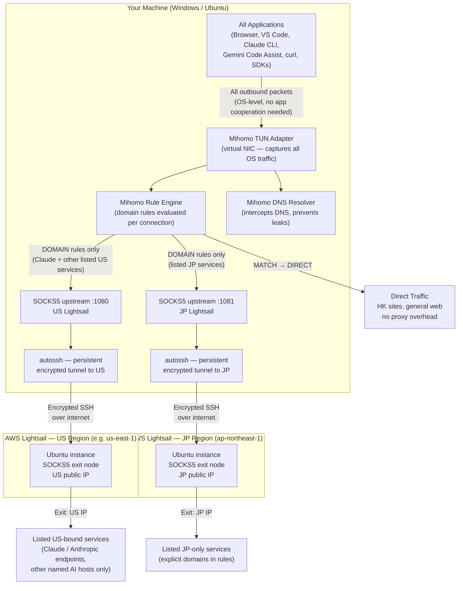
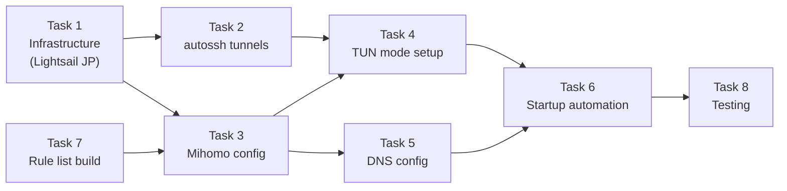

# GeoShift — Architecture & Technical Documentation

> **Purpose:** A multi-platform, multi-region, protocol-agnostic geo-unblocking solution for **listed** Japanese and US-bound services (e.g. Claude across web/API/CLI/IDE, other AI tools you name explicitly) from Hong Kong — not whole-country traffic. Built on rule-based proxy routing via [Mihomo](https://github.com/MetaCubeX/mihomo) and persistent SSH tunnels to AWS Lightsail exit nodes.

---

## Table of Contents

1. [Problem Statement](#1-problem-statement)
2. [Goals & Non-Goals](#2-goals--non-goals) *(subsections: Linux-first rollout, Ubuntu-only prerequisites)*
3. [Core Technical Concepts](#3-core-technical-concepts)
4. [High-Level Architecture](#4-high-level-architecture)
5. [Traffic Flow — Step by Step](#5-traffic-flow--step-by-step)
6. [Why TUN Mode Closes the Gap](#6-why-tun-mode-closes-the-gap)
7. [Component Responsibilities](#7-component-responsibilities)
8. [Task Breakdown](#8-task-breakdown)
9. [Limitations & Known Constraints](#9-limitations--known-constraints)

---

## 1. Problem Statement

Residing in Hong Kong creates two categories of geo-restriction problems:

| Category | Examples | Why Blocked |
|---|---|---|
| Japanese content sites | DMM, NicoNico, Pixiv (adult/regional content), certain streaming | IP-based geo-fence enforcing Japan-only access |
| US AI services | Claude (claude.ai, API), ChatGPT, Gemini Code Assist, Google Antigravity | Service not licensed for HK; IP geo-fence blocks HK ranges |

The **access modes** also differ and each has different technical requirements:

| Access Mode | Examples | Challenge |
|---|---|---|
| Browser | claude.ai, dmm.co.jp | System proxy or PAC file is usually sufficient |
| IDE extensions | Gemini Code Assist in VS Code / Cursor, GitHub Copilot | Extension may or may not honour system proxy |
| CLI / API tools | `claude` CLI, `curl` API calls, SDK-based scripts | Many tools ignore system proxy entirely |

The previous project ([aws-vpn-tunnel-for-claude-ai](https://github.com/ihmcjacky/aws-vpn-tunnnel-for-claude-ai)) solved the browser case via SSH SOCKS5 + PAC file, but explicitly noted that CLI and non-HTTP traffic was **not covered**. GeoShift closes that gap.

---

## 2. Goals & Non-Goals

### Goals
- Cover all three access modes: browser, IDE extensions, CLI/API tools
- Support **selective** routing: **listed** services only (e.g. Claude family — web, API, CLI, Claude Code — → US exit; curated JP-only hosts → JP exit); all other traffic, including unlisted JP/US sites → **direct**
- Run on both **Windows** and **Ubuntu** without maintaining separate codebases — **deliver Ubuntu first**, then port to Windows
- Reuse existing AWS Lightsail infrastructure; add a JP instance
- Minimal performance overhead for non-proxied traffic (direct connections are untouched)

### Non-Goals
- Routing **all** traffic to the US or Japan by country (`GEOIP,US` / `GEOIP,JP` catch-alls) — only dedicated, maintained domain rules apply
- Full device VPN (all traffic through one tunnel) — this would be slower and unnecessary
- Anonymity or privacy guarantees beyond what SSH encryption provides
- Support for mobile devices

### Implementation order (Linux first)

| Phase | Platform | When |
|-------|----------|------|
| **Phase 1** | **Ubuntu** | **Now:** implement and validate Tasks 1–8 on the Linux test machine end-to-end. |
| **Phase 2** | Windows | **After** Phase 1 passes: port tunnels, Mihomo + WinTun, PowerShell / Task Scheduler, re-run the test matrix. |

The same `config.yaml` and rule lists are intended to work on both OSes eventually; only automation and TUN prerequisites differ. **Do not** block Phase 1 on WinTun, WSL2, or Windows Administrator setup.

### Prerequisites to prepare — Phase 1 (Ubuntu only)

Complete these **on the Ubuntu machine** that will run Mihomo and autossh. Skip Windows-specific items until Phase 2.

| Step | What to prepare |
|------|------------------|
| **1. Lightsail** | US + JP instances (Ubuntu), **static IPv4** each; **networking / firewall** allows **TCP 22** from wherever this Ubuntu host connects (your public IP or office IP). |
| **2. SSH** | Private key on this machine (e.g. `~/.ssh/lightsail.pem`, `chmod 600`). Verify `ssh -i … ubuntu@<US_IP>` and `ssh -i … ubuntu@<JP_IP>` **from this Ubuntu box**. |
| **3. Packages** | `autossh`, `curl` (and any clients you will test: browser, VS Code, Claude CLI, etc.). |
| **4. Mihomo** | Linux **mihomo** binary (match your CPU: x86_64 or arm64), install path agreed (e.g. `/usr/local/bin/mihomo`). |
| **5. sudo** | For `setcap` on the Mihomo binary (TUN without root) and for installing **systemd** units under `/etc/systemd/system/`. |
| **6. Local secrets** | Non-git file for IPs + key path (e.g. `geoshift.env` or `config.local.yaml`) — referenced by scripts/units; never commit keys. |
| **7. IPv6 (optional)** | Note whether you disable IPv6 or rely on Mihomo TUN IPv6 support (see §9). |

**Phase 2 (later) — prepare when starting Windows:** WinTun (`wintun.dll`), Mihomo Windows build, Administrator or Task Scheduler elevation, and WSL2 vs native tunnel strategy.

---

## 3. Core Technical Concepts

### 3.1 SOCKS5 Proxy

SOCKS5 is an application-layer proxy protocol (RFC 1928). A SOCKS5 server sits between a client and a destination server, forwarding TCP/UDP traffic on the client's behalf.

```
Client App  →  SOCKS5 proxy  →  Destination server
              (on localhost)     (appears to come from proxy's IP)
```

**Key property:** The destination server sees the proxy's IP address, not the client's. This is what enables geo-unblocking.

**Limitation:** The client application must explicitly support and be configured to use SOCKS5. Applications that do not check proxy settings — or are hardcoded to connect directly — bypass the proxy entirely.

### 3.2 SSH Dynamic Port Forwarding (`-D`)

SSH's `-D` flag creates a **SOCKS5 server on the local machine** that tunnels all traffic through the SSH connection to the remote host.

```bash
ssh -i key.pem -N -D 1080 user@lightsail-ip
#                 ^^^^^^^^ listen on local port 1080 as SOCKS5
```

What happens:
1. Local app connects to `127.0.0.1:1080` (the SOCKS5 listener)
2. SSH encrypts and tunnels the request to the Lightsail instance
3. Lightsail opens the connection to the actual destination
4. Response returns through the encrypted tunnel

**autossh** wraps this command with automatic reconnection logic, so the tunnel survives network interruptions and machine reboots.

### 3.3 PAC (Proxy Auto-Config) Files

A PAC file is a JavaScript file with a `FindProxyForURL(url, host)` function. Browsers call this function for each request and follow its return value (`DIRECT`, `PROXY host:port`, `SOCKS5 host:port`, etc.).

**Limitation:** PAC files are a browser concept. They have zero effect on IDE extensions, CLI tools, or any non-browser application. This is why the previous project's approach did not cover Claude CLI or Gemini Code Assist.

### 3.4 System Proxy Settings (HTTP_PROXY / HTTPS_PROXY)

Both Windows (via `Settings > Network > Proxy`) and Linux (via environment variables `http_proxy`, `https_proxy`) expose a system-wide proxy configuration.

**Limitation:** These are **opt-in** — each application must explicitly read these settings and honour them. Many CLI tools, language runtimes (Go, Rust), and IDE extensions either ignore them entirely or only partially support them.

### 3.5 TUN Mode (Virtual Network Adapter)

TUN (Network TUNnel) is a Linux kernel feature (also available on Windows via the WinTun driver) that lets a userspace program create a **virtual Layer-3 network interface**.

When Mihomo runs in TUN mode:
1. It creates a virtual NIC (e.g., `utun0` / `Meta`) and assigns it an IP
2. Mihomo installs OS routing rules that redirect all outbound traffic to this virtual NIC
3. Every packet from every application — regardless of whether it knows about proxies — flows into Mihomo
4. Mihomo reads the destination IP/domain, evaluates its rule list, and forwards the connection to the appropriate upstream proxy or directly

This is **functionally identical to how a VPN client works**, with one critical difference: instead of routing everything through one tunnel based on IP ranges, Mihomo routes based on **domain name rules** evaluated per-connection.

### 3.6 Rule-Based Routing (Mihomo Rule Engine)

Mihomo's rule list is an ordered list of match conditions evaluated top-to-bottom. The first matching rule wins.

```yaml
rules:
  - DOMAIN-SUFFIX,claude.ai,US-PROXY       # example: Claude web
  - DOMAIN-SUFFIX,anthropic.com,US-PROXY   # API, CLI, Claude Code — add every host your tools use
  - DOMAIN-SUFFIX,openai.com,US-PROXY      # other US AI products only if you list them
  - DOMAIN-SUFFIX,dmm.co.jp,JP-PROXY       # example: curated JP service
  - DOMAIN-SUFFIX,nicovideo.jp,JP-PROXY
  # Intentionally no GEOIP,US / GEOIP,JP — random US/JP sites stay DIRECT
  - MATCH,DIRECT                           # everything not listed → direct
```

Rule types available:

| Rule Type | Matches On | Example |
|---|---|---|
| `DOMAIN` | Exact domain | `DOMAIN,claude.ai,PROXY` |
| `DOMAIN-SUFFIX` | Domain and all subdomains | `DOMAIN-SUFFIX,anthropic.com,PROXY` |
| `DOMAIN-KEYWORD` | Any domain containing keyword | `DOMAIN-KEYWORD,openai,PROXY` |
| `IP-CIDR` | Destination IP range | `IP-CIDR,172.217.0.0/16,PROXY` |
| `GEOIP` | IP country code (MaxMind DB) | `GEOIP,US,PROXY` |
| `MATCH` | Catch-all (always last) | `MATCH,DIRECT` |

`GEOIP` rules are optional; GeoShift intentionally does **not** use country-wide `GEOIP,US` / `GEOIP,JP` entries so ordinary browsing to those regions stays direct.

### 3.7 DNS Leak Prevention

When TUN mode is active, Mihomo also intercepts DNS queries. Without this, a DNS query for `claude.ai` would go directly to the ISP's DNS server in HK, revealing the hostname being accessed even if the subsequent HTTPS traffic goes through the tunnel.

Mihomo resolves domains via **fake-ip** or **redir-host** mode:
- **fake-ip**: Mihomo returns a synthetic private IP (e.g., `198.18.x.x`) immediately, then maps the real IP after the connection is established through the correct proxy
- **redir-host**: Mihomo resolves the real IP but routes the DNS query itself through the proxy

Both modes ensure DNS queries for proxied domains travel through the encrypted tunnel to the exit node's DNS, not the local ISP.

---

## 4. High-Level Architecture



---

## 5. Traffic Flow — Step by Step

### Scenario A: Browser accessing `claude.ai`

```
1. Browser initiates TCP connection to claude.ai:443

2. OS routing table: all traffic → Mihomo TUN adapter (utun0 / Meta)

3. Mihomo TUN receives the TCP SYN packet
   - Reads destination: claude.ai:443
   - Queries internal DNS: "what is claude.ai?" → fake-ip returned immediately

4. Mihomo Rule Engine evaluates rules (top to bottom):
   - DOMAIN-SUFFIX,claude.ai,US-PROXY  ← MATCH
   - Dispatch: connect via SOCKS_US

5. Mihomo opens SOCKS5 connection to 127.0.0.1:1080
   - autossh is listening on :1080, tunneling to US Lightsail via SSH

6. US Lightsail receives the tunneled connection
   - Opens TCP to claude.ai:443 from its own US IP address
   - Anthropic's servers see: US IP → access granted

7. TLS handshake completes end-to-end (Mihomo is transparent to TLS)

8. Response flows back:
   claude.ai → US Lightsail → SSH tunnel → Mihomo → TUN → Browser
```

### Scenario B: `claude` CLI tool making an API call to `api.anthropic.com`

```
1. Claude CLI calls api.anthropic.com:443 — does NOT check system proxy settings

2. OS routing: packet hits Mihomo TUN anyway (all traffic, no exceptions)

3. Rule match: DOMAIN-SUFFIX,anthropic.com,US-PROXY

4. Same path as Scenario A from step 5 onward

Result: CLI tool works transparently, zero configuration change needed in the tool itself
```

### Scenario C: VS Code with Gemini Code Assist connecting to `generativelanguage.googleapis.com`

```
1. VS Code extension connects to googleapis.com:443

2. Mihomo TUN intercepts (extension's proxy configuration irrelevant)

3. Rule match: DOMAIN-SUFFIX,googleapis.com,US-PROXY

4. Traffic exits from US Lightsail IP → Google API access granted
```

### Scenario D: Accessing `dmm.co.jp` in browser

```
1. Browser: TCP SYN to dmm.co.jp:443

2. Mihomo Rule Engine:
   - DOMAIN-SUFFIX,dmm.co.jp,JP-PROXY  ← MATCH

3. Connection goes through SOCKS_JP (:1081) → SSH tunnel → JP Lightsail

4. DMM servers see: JP IP → access granted
```

### Scenario E: Accessing a HK-friendly site (e.g., `google.com.hk`)

```
1. TCP SYN to google.com.hk:443

2. Mihomo Rule Engine: no specific rule matches
   - Falls through to: MATCH,DIRECT

3. Mihomo passes the packet directly to the OS network stack
   - No tunnel, no SSH overhead
   - Exits from your HK IP as normal

Result: No performance impact for non-proxied traffic
```

### Scenario F: DNS resolution (leak prevention)

```
1. Any app queries DNS for "claude.ai" (UDP :53)

2. Mihomo TUN intercepts the DNS packet before it reaches the ISP DNS

3. Mihomo checks: does "claude.ai" match a proxied rule? → Yes (US-PROXY)

4. DNS query is forwarded through the US SSH tunnel to an upstream resolver
   (e.g., 8.8.8.8 resolved from the US Lightsail instance)

5. Real IP returned and mapped internally; fake-ip returned to the app

Result: ISP never sees that you queried "claude.ai"; no DNS leak
```

---

## 6. Why TUN Mode Closes the Gap

This is the critical architectural insight that distinguishes GeoShift from the PAC/system-proxy approach.

### The proxy opt-in problem

```
Application
    │
    ├── Does it check HTTP_PROXY env var? → Only if developer implemented it
    ├── Does it check Windows system proxy? → Only if it uses WinINet/WinHTTP
    ├── Does it accept a --proxy flag? → Only if developer added one
    └── If none of the above: connects directly, bypasses all proxy config
```

Examples of tools that commonly **ignore** system proxy:
- Go-based CLI tools (many AWS tools, Terraform, Claude CLI built with Go)
- Electron apps using native fetch (some IDE extensions)
- Tools using libcurl without proxy env vars compiled in
- gRPC connections in some SDK implementations

### OSI layer comparison

| Approach | OSI Layer | Captures |
|---|---|---|
| PAC file | Layer 7 (Application) | Browser only |
| System proxy (HTTP_PROXY) | Layer 7 (Application) | Apps that opt in |
| SOCKS5 configured per-app | Layer 5 (Session) | Apps that opt in |
| TUN mode (Mihomo) | Layer 3 (Network) | **All apps, no exceptions** |
| Full VPN (WireGuard/OpenVPN) | Layer 3 (Network) | All apps, no exceptions |

TUN and full VPN operate at the same layer — the difference is that TUN gives Mihomo per-connection control over routing decisions via domain rules, whereas a full VPN routes everything through one tunnel regardless of destination.

```
Full VPN:         All traffic  →  Single tunnel  →  One exit IP
GeoShift (TUN):   All traffic  →  Mihomo rules   →  US / JP exit (listed hosts only) / DIRECT
                                  (explicit domains, not whole countries)
```

---

## 7. Component Responsibilities

| Component | Role | Platform |
|---|---|---|
| **Mihomo** | Rule engine, TUN virtual NIC, DNS interception, upstream proxy dispatch | Windows (x86\_64 binary) + Linux (x86\_64 / arm64 binary) |
| **WinTun driver** | Kernel-level TUN adapter implementation for Windows | Windows only |
| **autossh** | Persistent SSH tunnel with automatic reconnection on failure | Linux native; Windows via WSL2 or Git Bash |
| **AWS Lightsail US** | SOCKS5 exit node, provides a US public IP | Cloud (us-east-1 recommended) |
| **AWS Lightsail JP** | SOCKS5 exit node, provides a JP public IP | Cloud (ap-northeast-1) |
| **Mihomo config.yaml** | Defines proxies, proxy groups, rule list, DNS settings | Shared (same file works on Win + Linux) |
| **Startup script (PowerShell)** | Brings up autossh tunnels + Mihomo on Windows login | Windows |
| **Startup script (bash / systemd)** | Brings up autossh tunnels + Mihomo on Ubuntu boot | Linux |
| **Rule lists** | Explicit domain lists per product (e.g. all Anthropic/Claude endpoints); not full-country routing | Platform-agnostic (YAML) |

---

## 8. Task Breakdown

The implementation is divided into 8 tasks in dependency order. **Execute Phase 1 on Ubuntu through Task 8 before** starting Windows (Phase 2) automation and WinTun setup.



### Task 1 — Infrastructure: AWS Lightsail JP Instance

**Scope:** Provision a second Lightsail instance in the `ap-northeast-1` (Tokyo) region. The US instance from the previous project is already available.

**Deliverables:**
- JP Lightsail instance running Ubuntu, static IP assigned
- SSH key pair configured for passwordless login
- Both instances' IPs and `.pem` key paths recorded in `config.ini`

**Notes:** No additional software needed on the Lightsail instances — the SSH server (`sshd`) and TCP forwarding are sufficient. SOCKS5 proxying is performed by the SSH client on the local machine; the server just relays the traffic.

---

### Task 2 — autossh Tunnel Setup

**Scope (Phase 1 — Ubuntu):** Establish persistent SOCKS5 tunnels on the **Ubuntu test machine** using `autossh`. Two tunnels run locally at once:
- `autossh ... -D 1080 ... us-lightsail` (US exit on local port 1080)
- `autossh ... -D 1081 ... jp-lightsail` (JP exit on local port 1081)

**Scope (Phase 2 — Windows):** Repeat the same port layout on Windows (WSL2, Git Bash, or another supported approach) after Linux validation.

**Deliverables (Phase 1):**
- `autossh` installed on Ubuntu (`apt`) and both tunnel commands tested
- Reconnection verified (kill the child `ssh`; confirm `autossh` restarts it)

**Platform notes:**
- **Ubuntu (now):** native `autossh` via `apt`
- **Windows (later):** WSL2 (recommended) or standalone / Git Bash — documented in Phase 2

---

### Task 3 — Mihomo Configuration

**Scope:** Write the core `config.yaml` on **Ubuntu first**; keep it portable so the same file (paths permitting) can be reused on Windows in Phase 2.

**Key sections to configure:**

```yaml
# Proxy definitions (upstream SOCKS5 targets)
proxies:
  - name: US-Lightsail
    type: socks5
    server: 127.0.0.1
    port: 1080
  - name: JP-Lightsail
    type: socks5
    server: 127.0.0.1
    port: 1081

# Proxy groups (for UI dashboard toggling)
proxy-groups:
  - name: US-PROXY
    type: select
    proxies: [US-Lightsail, DIRECT]
  - name: JP-PROXY
    type: select
    proxies: [JP-Lightsail, DIRECT]

# Rules (evaluated top-to-bottom, first match wins)
rules:
  - DOMAIN-SUFFIX,claude.ai,US-PROXY
  - DOMAIN-SUFFIX,anthropic.com,US-PROXY
  - DOMAIN-SUFFIX,openai.com,US-PROXY
  - DOMAIN-SUFFIX,chatgpt.com,US-PROXY
  - DOMAIN-SUFFIX,googleapis.com,US-PROXY
  - DOMAIN-SUFFIX,gemini.google.com,US-PROXY
  - DOMAIN-SUFFIX,dmm.co.jp,JP-PROXY
  - DOMAIN-SUFFIX,nicovideo.jp,JP-PROXY
  # No GEOIP country catch-alls — extend this list when a tool needs a new hostname
  - MATCH,DIRECT
```

**Deliverables:**
- On **Ubuntu:** `config.yaml` tested with Mihomo in non-TUN mode first (SOCKS5 only) to validate rules
- Proxy groups verified via Mihomo dashboard (`http://127.0.0.1:9090/ui` after `external-ui` panel is present — see repo `config/config.yaml` and Phase 2 Step 8)

---

### Task 4 — TUN Mode Setup

**Scope:** Enable Mihomo's TUN adapter. **Phase 1:** Ubuntu only. **Phase 2:** Windows + WinTun. TUN captures all OS traffic, not just browser traffic.

**Windows specifics (Phase 2):**
- Download `wintun.dll` from [wintun.net](https://www.wintun.net) and place in Mihomo's directory
- Run Mihomo as Administrator (TUN requires elevated privileges to create the virtual NIC)
- Add to `config.yaml`:
  ```yaml
  tun:
    enable: true
    stack: mixed       # gVisor for UDP, system for TCP — best compatibility
    auto-route: true   # installs OS routing rules automatically
    auto-detect-interface: true
  ```

**Linux (Ubuntu) specifics (Phase 1):**
- Grant Mihomo `cap_net_admin` capability (avoids running as root):
  ```bash
  sudo setcap cap_net_admin,cap_net_bind_service+ep /usr/local/bin/mihomo
  ```
- Same TUN config block in `config.yaml`

**Deliverables:**
- **Phase 1:** TUN active on Ubuntu (`ip addr` shows Mihomo tun); a proxy-agnostic `curl` to a listed US host exits via US Lightsail
- **Phase 2:** Repeat on Windows (Device Manager / admin Mihomo) when porting

---

### Task 5 — DNS Configuration

**Scope:** Configure Mihomo's built-in DNS to prevent DNS leaks and support domain-based rule matching.

```yaml
dns:
  enable: true
  listen: 0.0.0.0:53
  enhanced-mode: fake-ip
  fake-ip-range: 198.18.0.1/16
  nameserver:
    - 8.8.8.8          # resolved through proxy when domain matches proxy rule
    - 1.1.1.1
  fallback:
    - 114.114.114.114  # HK/CN fallback for non-proxied domains
  fallback-filter:
    geoip: true
    geoip-code: CN
```

**Deliverables:**
- DNS leak test confirms that queries for proxied domains resolve via the exit node's DNS
- `claude.ai` resolves to a fake-ip range entry (e.g., `198.18.x.x`) confirming interception is working

---

### Task 6 — Startup Automation

**Scope:** Automate bring-up. **Phase 1:** ship **Ubuntu** first (`start-geoshift.sh` + systemd). **Phase 2:** add Windows (`Start-GeoShift.ps1` + Task Scheduler).

**Ubuntu (Phase 1 — primary):**
1. `geoshift-tunnel-us.service` — systemd unit for autossh US tunnel
2. `geoshift-tunnel-jp.service` — systemd unit for autossh JP tunnel
3. `geoshift-mihomo.service` — systemd unit for Mihomo (depends on both tunnel services)

**Windows (Phase 2):** `Start-GeoShift.ps1` — ensure autossh tunnels, wait for 1080/1081, launch Mihomo elevated, optional dashboard open.

**Deliverables:**
- **Phase 1:** `systemctl enable …` brings the full stack up on Ubuntu boot
- **Phase 2:** Windows script + scheduled task (or equivalent)

---

### Task 7 — Rule List Build & Maintenance

**Scope:** Build the initial domain rule lists and establish a maintenance process.

**Initial rule sets:**
- **Per product:** enumerate every hostname each tool hits (Claude web vs API vs CLI vs IDE extensions may differ; add CDN or auth domains as you discover them)
- Same idea for any other US AI or JP-only product you actually use — not “all `.jp`” or “all US IPs”

**Community rule sources (optional, for larger lists):**
- [Loyalsoldier/clash-rules](https://github.com/Loyalsoldier/clash-rules) — maintained lists for common services
- These can be loaded via `rule-providers` in `config.yaml` with automatic updates

**Deliverables:**
- Curated `rules/us-ai.yaml` and `rules/jp-sites.yaml`
- `config.yaml` updated to reference these via `rule-providers`

---

### Task 8 — Testing & Validation

**Scope:** Verify end-to-end on the **Ubuntu test host** in Phase 1 (browser, `curl`, CLI, IDE as applicable). Re-run the same matrix on **Windows** in Phase 2 after porting.

**Test matrix:**

| Scenario | Tool | Expected exit IP | Pass criteria |
|---|---|---|---|
| claude.ai web | Chrome | US IP | Page loads, no geo-block |
| api.anthropic.com | `curl` (direct, no proxy flag) | US IP | 200 response with API key |
| Gemini Code Assist | VS Code extension | US IP | Code suggestions working |
| Claude CLI | `claude` command | US IP | CLI connects and responds |
| dmm.co.jp | Chrome | JP IP | Site loads, no geo-block |
| google.com.hk | Chrome | HK IP | Direct, no tunnel |
| IP check | `curl ifconfig.me` via specific proxy | Per-rule | Correct IP per proxy |

**Validation tools:**
- `curl ifconfig.me` — check exit IP
- [ipleak.net](https://ipleak.net) — check DNS leaks
- [browserleaks.com](https://browserleaks.com) — WebRTC and DNS leak check
- Mihomo dashboard (`http://127.0.0.1:9090/ui`) — real-time connection log to confirm rule matches (same `external-ui` / one-time panel fetch as in repo `config/config.yaml`; Windows walkthrough in Phase 2 Step 8)

---

## 9. Limitations & Known Constraints

| Constraint | Impact | Mitigation |
|---|---|---|
| TUN mode requires elevated privileges on Windows | Script must run as Administrator or via Task Scheduler with "Run as administrator" | Pre-configure Task Scheduler entry at setup; first WinTun/driver consent may require an interactive elevated run (SYSTEM cannot click UAC) |
| OpenSSH private key ACLs (Windows) | `ssh` as SYSTEM rejects keys under another user’s profile if ACLs are “too open” | Use `C:\ProgramData\GeoShift\ssh-keys\` with **SYSTEM-only** `(R)`; see §10 “Windows: installation and runtime notes” |
| autossh on Windows requires WSL2 or Git Bash | Additional dependency on Windows | Document WSL2 as a prerequisite; alternatively use `plink` (PuTTY) as a Windows-native alternative |
| SSH tunnel latency | Adds ~20-80ms RTT depending on server location | Acceptable for API calls and web browsing; not suitable for real-time voice/video |
| Lightsail instance costs | Two instances (US + JP) at ~$3.50–$5/month each | Minimal; can share instances with other projects |
| Rule list maintenance | New services or CDN domains may require rule additions | Use community `rule-providers` for auto-updated lists |
| Mihomo `/ui` shows **404** | The core serves the API on `external-controller`; static files are only mounted when `external-ui` is set and populated | Repo `config.yaml` sets `external-ui` + `external-ui-url`; run once: `Invoke-RestMethod -Method Post -Uri http://127.0.0.1:9090/upgrade/ui` (add `Authorization: Bearer …` if `secret` is set). Optional: hosted [yacd](https://yacd.metacubex.one/?hostname=127.0.0.1&port=9090) instead of local files—`external-controller-cors` exists for that case only. |
| TLS inspection not possible | Mihomo cannot inspect encrypted traffic content; routing is domain-based only | Not a limitation for this use case; geo-unblocking only needs to route the connection, not inspect it |
| IPv6 leak risk | Some TUN implementations may not intercept IPv6 traffic | Disable IPv6 on the machine or ensure Mihomo's TUN config covers IPv6 |

---

## 10. Phase 2 — Windows Platform

### Overview

Phase 2 ports GeoShift to Windows 10/11 using the **same `config.yaml` and rule lists** as Phase 1. Only the automation layer differs: Bash/systemd is replaced by PowerShell/Task Scheduler, and `autossh` is replaced by a PowerShell reconnect loop using Windows built-in `ssh.exe`.

### Component Equivalence

| Linux (Phase 1) | Windows (Phase 2) | Notes |
|---|---|---|
| `autossh` | PowerShell reconnect loop + `ssh.exe` | `ssh.exe` ships with Windows 10/11 (OpenSSH Client optional feature) |
| `systemd` service units | Task Scheduler tasks (SYSTEM account) | Run at boot, no UAC, no console window |
| `install.sh` | `install.ps1` | One-shot, run as Administrator |
| `tunnel-us.sh` | `tunnel-us.ps1` | Same SSH flags, `-D 1080` SOCKS5 |
| `mihomo-run.sh` | `mihomo-run.ps1` | Both use **`mihomo -d <configDir>`** only; Windows wrapper redirects stdout/stderr to log files (Mihomo has no `--log-file` flag) |
| `/etc/geoshift/geoshift.env` | `C:\ProgramData\GeoShift\geoshift.env` | Same key=value format |
| `/usr/local/lib/geoshift/` | `C:\Program Files\GeoShift\` | Scripts + mihomo.exe + wintun.dll |
| `setcap cap_net_admin` | WinTun driver + SYSTEM privileges | TUN mode on Windows requires SYSTEM or admin |
| `sysctl` IPv6 disable | Optional: `Disable-NetAdapterBinding` | Skipped by default to minimize system changes |

### Prerequisites

- Windows 10 or 11 (x86-64)
- **OpenSSH Client** feature enabled (Settings → Apps → Optional Features → OpenSSH Client)
- Run `install.ps1` once as **Administrator** (only needed for setup; services run as SYSTEM thereafter)
- **SSH key for SYSTEM:** OpenSSH rejects keys under `C:\Users\…\.ssh\` when ACLs are “too open” (e.g. your user and SYSTEM both have access). Copy the `.pem` to `C:\ProgramData\GeoShift\ssh-keys\`, set ACL to **only** `NT AUTHORITY\SYSTEM:(R)`, and set `SSH_PRIVATE_KEY` in `geoshift.env` to that path (see Installation step 5 and Verification step 4).

### File Locations

| Purpose | Path |
|---|---|
| Scripts + binaries | `C:\Program Files\GeoShift\` |
| Config, env, logs | `C:\ProgramData\GeoShift\` |
| Env file | `C:\ProgramData\GeoShift\geoshift.env` |
| SSH key (recommended for Task Scheduler) | `C:\ProgramData\GeoShift\ssh-keys\*.pem` (ACL: SYSTEM read only) |
| Mihomo config | `C:\ProgramData\GeoShift\config\config.yaml` |
| Tunnel log | `C:\ProgramData\GeoShift\logs\tunnel-us.log` |
| Tunnel SSH stderr (raw) | `C:\ProgramData\GeoShift\logs\tunnel-us-ssh.err` |
| Mihomo wrapper log | `C:\ProgramData\GeoShift\logs\mihomo.log` |
| Mihomo core log | `C:\ProgramData\GeoShift\logs\mihomo-core.log` |
| Mihomo stderr (on failure) | `C:\ProgramData\GeoShift\logs\mihomo-stderr.log` (also copied into `mihomo.log` by `mihomo-run.ps1`) |

### Log Rotation

Each log file is capped at **1 MB** with **1 rotated backup** (`.log.1`). Maximum ~6 MB across all log files. Rotation is size-checked before each write (tunnel/wrapper logs) or at startup (core log).

### Task Scheduler Tasks

Both tasks run as **SYSTEM** with highest privileges — no UAC prompts, no visible window, start at boot before user login.

| Task Name | Script | Trigger | Restart |
|---|---|---|---|
| `GeoShift-Tunnel-US` | `tunnel-us.ps1` | At startup | On failure, **1 minute** delay, unlimited |
| `GeoShift-Mihomo` | `mihomo-run.ps1` | At startup + 10s delay | On failure, **1 minute** delay, unlimited |

The 10s delay on `GeoShift-Mihomo` ensures the SSH tunnel is up before Mihomo starts (replaces `After=geoshift-tunnel-us.service`).

### Installation Steps

1. Clone the repo or copy files to a working directory
2. Open PowerShell as **Administrator**
3. Run: `powershell -ExecutionPolicy Bypass -File scripts\install.ps1`
4. Edit `C:\ProgramData\GeoShift\geoshift.env` with your Lightsail IP and SSH user
5. **SSH private key (required for tunnel running as SYSTEM):** Do **not** point `SSH_PRIVATE_KEY` at a file under your profile if OpenSSH reports “permissions too open” / “bad permissions”. Instead:
   - Create `C:\ProgramData\GeoShift\ssh-keys\` and copy your Lightsail `.pem` there (same filename is fine).
   - In an elevated prompt: `icacls "C:\ProgramData\GeoShift\ssh-keys\your.pem" /inheritance:r` then `icacls "…\your.pem" /grant:r "SYSTEM:(R)"`. Confirm with `icacls` that **only** `NT AUTHORITY\SYSTEM` has access.
   - Set `SSH_PRIVATE_KEY=C:\ProgramData\GeoShift\ssh-keys\your.pem` in `geoshift.env`. Keep the original under `C:\Users\you\.ssh\` for interactive `ssh` only.
6. Reboot (or start tasks manually from Task Scheduler / PowerShell)

### Windows: installation and runtime notes (troubleshooting reference)

This section summarizes issues that commonly appear when bringing up GeoShift on Windows 10/11 with **PowerShell 5.1**, **Task Scheduler (LOCAL SYSTEM)**, **OpenSSH**, and **Mihomo**. It complements Installation step 5 and Verification below.

#### PowerShell scripts and `install.ps1`

- **UTF-8 with BOM for `.ps1` files.** Windows PowerShell 5.1 loads scripts **without** a byte-order mark using the system ANSI code page (e.g. Windows-1252), not UTF-8. That produces mojibake and can break parsing. The repo ships `scripts\install.ps1`, `tunnel-us.ps1`, and `mihomo-run.ps1` as **UTF-8 with BOM**; keep that when saving from an editor.
- **ASCII punctuation in scripts** (hyphen instead of Unicode em dash in double-quoted strings) avoids rare tokenizer edge cases on 5.1. **PowerShell 7 (`pwsh`)** is more UTF-8-friendly; scheduled tasks still use `powershell.exe` (5.1) unless you change them.
- **Task Scheduler restart interval:** The scheduler API requires a **restart interval of at least one minute**. Shorter values (for example **PT5S**) fail with `0x80041318` / “incorrectly formatted or out of range.” `install.ps1` registers tasks with a **one-minute** restart interval.

#### SSH tunnel (`GeoShift-Tunnel-US`)

- **Runs as LOCAL SYSTEM**, not your interactive user. Manual `ssh -i …` as *you* can succeed while the task still fails until `geoshift.env` and key ACLs match **SYSTEM**.
- **“Bad permissions” / “too open”:** Point `SSH_PRIVATE_KEY` at a **ProgramData** copy with **only** `NT AUTHORITY\SYSTEM:(R)` on the ACL (see Installation step 5). A key under `C:\Users\…\.ssh\` with both **you** and **SYSTEM** allowed is often rejected by OpenSSH for the SYSTEM-run tunnel.
- **Logs:** `tunnel-us.ps1` records SSH **stderr** in `tunnel-us.log` (lines prefixed `ssh:`) and in `logs\tunnel-us-ssh.err`. **Exit code 255** is generic; those lines carry the real reason.
- **`ssh -v`:** An early `identity file … type -1` can be a red herring; rely on `Trying private key` and `Authenticated to … using "publickey"`.
- **Quiet `tunnel-us.log`:** One line `Starting tunnel to …` and **no** `ssh.exe exited` line usually means **success** while `ssh` stays connected. Confirm with `Get-Process ssh` and `Get-NetTCPConnection -LocalPort 1080 -State Listen`.

#### Mihomo (`GeoShift-Mihomo`)

- **No `--log-file` flag.** Mihomo is invoked as **`mihomo.exe -d <configDir>`** only (aligned with Linux `mihomo-run.sh`). Unknown flags (including **`--log-file`**) print **usage text to stderr** and often exit with **code 2**.
- **Logs:** `mihomo-run.ps1` redirects **stdout** to `mihomo-core.log` and **stderr** to `mihomo-stderr.log`; on non-zero exit it appends tails into `mihomo.log`.
- **WinTun / TUN and prompts:** With `tun.enable: true`, an interactive elevated run may show a **driver or capability** dialog. **SYSTEM** has **no desktop** to approve it. Complete setup once while logged in (or reboot after a successful interactive run), then rely on auto-start. If the task still fails, options include running the Mihomo task **as your user** or turning **TUN off** and using **proxy ports** (`7890` / `7891`) only.

#### Task Scheduler **State** column

- **`GeoShift-Tunnel-US` = Running** is expected while the tunnel is up (`tunnel-us.ps1` blocks inside a reconnect loop).
- **`GeoShift-Mihomo` = Ready** means the **scheduled action finished** (wrapper exited), not necessarily that Mihomo is down. If `mihomo.exe` is still running, the task may show **Running**; if Mihomo exited, **Ready** is normal. Use **`Get-Process mihomo`** to confirm.

#### Verifying US egress over SOCKS

- Some sites return **IPv6**; for a clear **IPv4** check:  
  `curl.exe -s --max-time 20 --proxy socks5h://127.0.0.1:1080 https://api.ipify.org`

#### Updating scripts after `git pull`

- **Copy** revised `tunnel-us.ps1` / `mihomo-run.ps1` into **`C:\Program Files\GeoShift\`**, or **re-run** `install.ps1` as Administrator, so Task Scheduler runs the latest versions.

#### Automated verification script

- From the repo:  
  `powershell -ExecutionPolicy Bypass -File scripts\verify-geoshift.ps1`  
  Checks paths, `geoshift.env` (sanitized), tasks, processes, log tails, and ports **1080** / **9090**.

### Verification

Follow these steps **after installation and configuration** to verify GeoShift is working on Windows 11. For a scripted smoke test, run `scripts\verify-geoshift.ps1` (see above).

#### Step 1: Verify Installer Completed Successfully

```powershell
# Check that directories were created
Test-Path 'C:\Program Files\GeoShift'
Test-Path 'C:\ProgramData\GeoShift'
Test-Path 'C:\ProgramData\GeoShift\logs'

# Check that binaries were downloaded
Get-ChildItem 'C:\Program Files\GeoShift' | Select-Object Name
# Expected: mihomo.exe, wintun.dll, tunnel-us.ps1, mihomo-run.ps1
```

**Expected output:** All paths exist, four files listed.

**If failed:** Re-run `install.ps1` as Administrator and check for error messages.

---

#### Step 2: Verify Config and Environment

```powershell
# Check env file exists and has content
Get-Content 'C:\ProgramData\GeoShift\geoshift.env'

# Verify config.yaml is present
Get-ChildItem 'C:\ProgramData\GeoShift\config' -Filter '*.yaml'
```

**Expected output:**
- Env file shows `US_LIGHTSAIL_IP=...`, `SSH_PRIVATE_KEY=...`, etc. (not placeholder values)
- `config.yaml` and rule files are listed

**If failed:**
- Edit `C:\ProgramData\GeoShift\geoshift.env` and fill in real values
- Copy `config/` from your repo to `C:\ProgramData\GeoShift\config\`

---

#### Step 3: Verify Task Scheduler Tasks Registered

```powershell
# List GeoShift tasks
Get-ScheduledTask -TaskName GeoShift-* | Select-Object TaskName, State

# View task details
Get-ScheduledTask -TaskName GeoShift-Tunnel-US | Get-ScheduledTaskInfo
Get-ScheduledTask -TaskName GeoShift-Mihomo | Get-ScheduledTaskInfo
```

**Expected output:**
- Two tasks listed: `GeoShift-Tunnel-US` and `GeoShift-Mihomo`
- While healthy, **`GeoShift-Tunnel-US` often shows `State=Running`** (long-running `ssh` loop). **`GeoShift-Mihomo` may show `Ready`** after the wrapper exits even if you expect Mihomo to be up; use **`Get-Process mihomo`** to confirm the process. When Mihomo is running under the wrapper, its task may show **Running**.
- Task info: no persistent failures (`LastTaskResult = 0` after successful runs; `NextRunTime` as appropriate for startup triggers)

**If failed:**
- Tasks may not be registered: re-run `install.ps1` as Administrator
- Tasks may have failed: check logs (Step 7 below)

---

#### Step 4: SSH Key for the Tunnel (SYSTEM + OpenSSH)

The scheduled tunnel runs `ssh` as **LOCAL SYSTEM**. OpenSSH will ignore a key that is “too open” (typically a `.pem` under your user profile with both you and SYSTEM on the ACL).

**Recommended:** use a copy under ProgramData with **only** SYSTEM allowed to read it, and reference it in `geoshift.env`.

```powershell
$destDir = 'C:\ProgramData\GeoShift\ssh-keys'
New-Item -ItemType Directory -Path $destDir -Force | Out-Null
Copy-Item 'C:\Users\YOUR_USERNAME\.ssh\lightsail.pem' -Destination "$destDir\lightsail.pem" -Force

$key = "$destDir\lightsail.pem"
icacls $key /inheritance:r
icacls $key /grant:r 'SYSTEM:(R)'
icacls $key
```

**Expected output:** `icacls` lists **only** `NT AUTHORITY\SYSTEM:(R)` for that file. In `geoshift.env`, `SSH_PRIVATE_KEY` must be this path (not the copy under `C:\Users\…\.ssh\`).

**If failed:** If you still see `bad permissions` in `tunnel-us.log`, remove any extra ACEs (Administrators, your user) until only SYSTEM remains, or run `takeown /F $key` as admin and re-apply `icacls` as above.

---

#### Step 5: Start Services Manually (Without Reboot)

Open PowerShell **as Administrator** and run:

```powershell
# Start tunnel first
Start-ScheduledTask -TaskName GeoShift-Tunnel-US
Start-Sleep -Seconds 3

# Start Mihomo (waits 10s by default, but may start immediately if manual)
Start-ScheduledTask -TaskName GeoShift-Mihomo
Start-Sleep -Seconds 5

# Check if processes are running
Get-Process | Where-Object { $_.Name -match 'ssh|mihomo' }
```

**Expected output:** `ssh.exe` and `mihomo.exe` processes listed.

**If no processes:** Check logs (Step 7) for errors.

---

#### Step 6: Verify Network Access — US Exit IP

```powershell
# Test SOCKS5 tunnel on localhost:1080
# Requires curl to be configured or a tool like netsh to route traffic

# Method 1: Direct curl if it auto-detects proxy (unlikely on Windows)
curl.exe https://ifconfig.me

# Method 2: Use the Mihomo dashboard (see Step 8)
# The dashboard shows connected clients and proxy group stats

# Method 3: Configure Firefox/Chrome to use SOCKS5 proxy 127.0.0.1:1080, then visit https://ifconfig.me
```

**Expected output:** IP address should match your AWS Lightsail US instance **IPv4** (not your home ISP IP). Some sites prefer **IPv6**; for an explicit IPv4 result through SOCKS:  
`curl.exe -s --proxy socks5h://127.0.0.1:1080 https://api.ipify.org`

**If you see your home ISP IP:** SSH tunnel is not running. Check logs (Step 7).

---

#### Step 7: Check Logs for Errors

```powershell
# View tunnel log (last 20 lines)
Write-Host "=== Tunnel Log ==="
Get-Content 'C:\ProgramData\GeoShift\logs\tunnel-us.log' -Tail 20

# View Mihomo wrapper log
Write-Host "=== Mihomo Wrapper Log ==="
Get-Content 'C:\ProgramData\GeoShift\logs\mihomo.log' -Tail 20

# View Mihomo core log (stdout from mihomo.exe)
Write-Host "=== Mihomo Core Log ==="
Get-Content 'C:\ProgramData\GeoShift\logs\mihomo-core.log' -Tail 20

# Mihomo stderr (invalid CLI flags, early crashes)
Write-Host "=== Mihomo stderr log ==="
Get-Content 'C:\ProgramData\GeoShift\logs\mihomo-stderr.log' -Tail 30
```

**Expected output:** Timestamps and INFO-level messages in core log. No ERROR or FATAL messages.

**Common errors:**
- `ERROR: env file not found` → Config or env file path wrong
- `ERROR: SSH key not found` → Path in `geoshift.env` incorrect
- `Load key "...": bad permissions` / `Permissions … are too open` → Use ProgramData key copy with SYSTEM-only ACL and set `SSH_PRIVATE_KEY` accordingly (Step 4 above)
- `ssh:` lines in `tunnel-us.log` or `tunnel-us-ssh.err` → Real SSH failure reason (auth, firewall, host key, etc.)
- **Mihomo stderr full of flag help** (`-f`, `-t`, `-v`, …) → Invalid CLI arguments (historically **`--log-file`**); wrapper must use **`mihomo.exe -d <dir>`** only (see “Windows: installation and runtime notes”)
- `ERROR: wintun.dll not found` → Installer failed to download WinTun
- `ERROR: no config at ...` → Mihomo config not copied to `C:\ProgramData\GeoShift\config\`
- **Mihomo exit code 2** after TUN enabled → Often WinTun/driver or first-run consent; see WinTun bullet under “Windows: installation and runtime notes”

---

#### Step 8: Open Mihomo Dashboard

Mihomo’s **REST API** listens on `http://127.0.0.1:9090`. The **web UI** is only available at **`/ui`** if [`external-ui`](https://wiki.metacubex.one/en/config/general/#external-user-interface) points at a directory that contains the panel assets. GeoShift’s `config/config.yaml` sets `external-ui` (`ui` under your config directory) and `external-ui-url` (metacubexd zip). When you open **`http://127.0.0.1:9090/ui`**, the page and the API share the same origin, so **you do not need CORS for that path**. The file also sets **`external-controller-cors`** only so an **optional** hosted dashboard (e.g. [yacd](https://yacd.metacubex.one))—loaded from the public web—can ask your browser to talk to `127.0.0.1:9090` without the browser blocking it.

**First run (or if you deleted the `ui` folder):** while Mihomo is running, download the panel into `external-ui`:

```powershell
Invoke-RestMethod -Method Post -Uri http://127.0.0.1:9090/upgrade/ui
```

If `config.yaml` has a non-empty `secret`, use:

```powershell
Invoke-RestMethod -Method Post -Uri http://127.0.0.1:9090/upgrade/ui `
  -Headers @{ Authorization = 'Bearer YOURSECRET' }
```

Then open the local UI:

```powershell
Start-Process 'http://127.0.0.1:9090/ui'
```

**Expected:** Dashboard loads, shows proxy groups (e.g., `US-PROXY`), and shows active connections when traffic goes through Mihomo.

**Troubleshooting:**

- **`404 page not found` on `/ui`:** The controller is usually up; panel files are missing or `external-ui` is wrong. Run the `Invoke-RestMethod` line above, confirm `ui` under your config directory (e.g. `C:\ProgramData\GeoShift\config\ui\` when using defaults) contains files, then reload.
- **Nothing answers on port 9090:** Mihomo did not start or did not bind the controller — check logs (Step 7).
- **Hosted panel instead of local files:** [yacd](https://yacd.metacubex.one/?hostname=127.0.0.1&port=9090) (add `&secret=…` if you use a secret). The repo CORS block is there for this pattern.

---

#### Step 9: Test End-to-End (Browser)

1. Open Firefox or Chrome
2. Set proxy to **SOCKS5 localhost:1080** (proxy settings or extension)
3. Visit https://ifconfig.me → Should show **US Lightsail IP** (not your home IP)
4. Visit https://claude.ai → Should connect successfully
5. In Mihomo dashboard, check the "Connections" tab → Should see entries for claude.ai traffic

**If blocked:**
- Check SSH tunnel is running (`ssh.exe` in Task Manager)
- Check Mihomo is running (`mihomo.exe` in Task Manager)
- Check logs (Step 7)

---

#### Step 10: Reboot and Verify Auto-Start

```powershell
# Reboot the machine
Restart-Computer

# After reboot, log back in and verify processes started automatically
Get-Process | Where-Object { $_.Name -match 'ssh|mihomo' }

# Or check task status
Get-ScheduledTask -TaskName GeoShift-* | Get-ScheduledTaskInfo
```

**Expected:** Both processes running automatically after boot, no prompts or visible windows.

---

#### Cleanup / Troubleshooting

If something goes wrong and you need to reset:

```powershell
# Stop services
Stop-ScheduledTask -TaskName GeoShift-Tunnel-US -ErrorAction SilentlyContinue
Stop-ScheduledTask -TaskName GeoShift-Mihomo -ErrorAction SilentlyContinue

# Kill processes if stuck
Get-Process ssh, mihomo -ErrorAction SilentlyContinue | Stop-Process -Force

# Clear logs (start fresh)
Remove-Item 'C:\ProgramData\GeoShift\logs\*' -Force -ErrorAction SilentlyContinue

# Re-run install.ps1 or manually start tasks again
```

### Stop / Disable

```powershell
Stop-ScheduledTask  -TaskName GeoShift-Mihomo
Stop-ScheduledTask  -TaskName GeoShift-Tunnel-US
# To disable permanently:
Disable-ScheduledTask -TaskName GeoShift-Mihomo
Disable-ScheduledTask -TaskName GeoShift-Tunnel-US
```

### Optional Hardening

- **Disable IPv6** (if DNS or traffic leaks observed):
  ```powershell
  Get-NetAdapter | ForEach-Object {
      Disable-NetAdapterBinding -Name $_.Name -ComponentID ms_tcpip6
  }
  ```
  Re-enable: replace `Disable-` with `Enable-`.

---

*Last updated: March 2026 (Windows troubleshooting section expanded from field experience.)*
